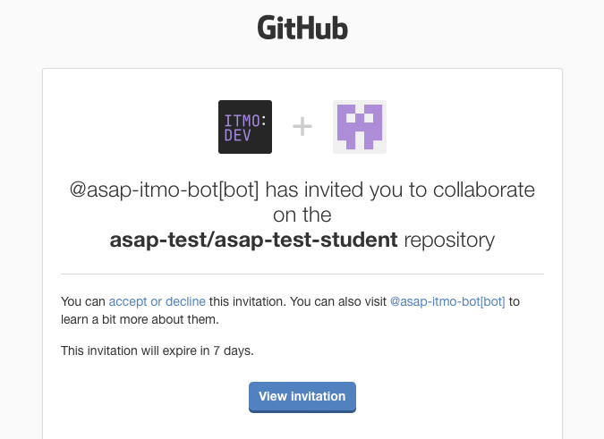
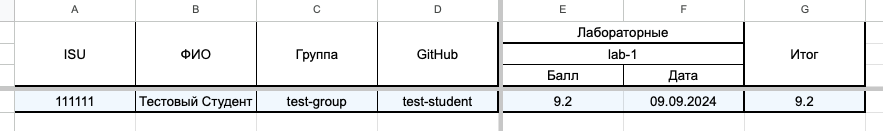
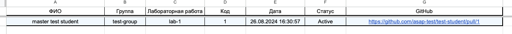
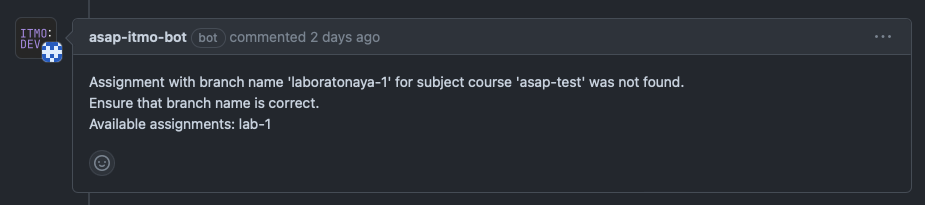

# ASAP – инструкция для студентов

ASAP – система, позволяющая автоматизировать отслеживание отправленных студентами работ, формирование очередей сдачи,
отслеживание событий сдачи работ и расчёт баллов студентов.

Для использования системы вам необходимо будет пройти регистрацию в ней. Ваши преподаватели предоставят вам форму в
которой это можно будет сделать.

В данной форме необходимо заполнить:

1. Ваше ФИО
2. Вашу группу (выбирается из списка)
3. Ваш номер ISU
4. Ваш гитхаб **ТЕГ**. Важно, указывайте именно тег, без символа `@`, не указывайте в данном поле сслыку на ваш профиль.
   Данный тег должен принадлежать вашему личному GitHub аккаунту, не какой-либо организации.
   Убедитесь что вы имеете доступ как к GitHub аккаунту, который вы указываете в форме, так и к почте, привязанной к
   нему.
5. Ваш Telegram.

После заполнения данной формы, вы должны будете ожидать приглашения в репозиторий организации GitHub вашего курса,
данный репозиторий будет иметь название, соответствующее вашему нику на GitHub. В этот репозиторий вы должны будете
загружать ваши работы на протяжении прохождения курса. Приглашение в данный репозиторий придёт вам на почту, к которой
привязан ваш GitHub аккаунт.

   

Также, система предоставляет возможность просмотра баллов и очередей на сдачу через Google таблицы, ссылку на таблицу
вашего предмета должны предоставить преподаватели.

   

   

# Основной workflow студента

## Загрузка работы

С точки зрения студента, работа с системой ASAP подразумевает простое взаимодействие с GitHub. Давайте рассмотрим какие
шаги необходимо сделать для того чтобы система увидела и начала отслеживать вашу работу

1. Перед началом выполнения лабораторной – создайте ветку с названием соответсвующим данной лабораторной работе
   Эти наименования настраиваются преподавателями и они предоставят вам информацию о корректном нейминге
2. Далее, после выполнения работы, запуште её на GitHub и создайте pull request из ветки лабораторной в ветку `master`/
   `main`.
    1. Если вы изначально выбрали некорректное название ветки, не соответствующее какой-либо лабораторной, вы получите
       комментарий-предупреждение от нашего бота.

       

    2. Если загрузка работы прошла успешно, бот так же оповестит вас об этом.

       

В терминах системы, работа, которую вы загружаете – называется сабмишен. И на одну лабораторную студент может иметь
несколько таких сабмишенов.

После успешной загрузки работы, ваш сабмишен должен появиться в соответсвующей очереди.

## Сдача работ

Как только сабмишен попадает в очередь, преподаватель может его проверить. У проверки может быть 3 результата:

1. Преподаватель не удовлетворён работой
   Такой результат происходит когда преподаватель оставляет change request в вашем pull request и ваш сабмишен пропадёт
   из очереди. Вы должны будете исправить замечания и загрузить исправления в ту же ветку, в тот же pull request. После
   загрузки исправлений, система создаст новый сабмишен и вы снова появитесь в очереди.
2. Преподаватель предварительно одобрил работу
   Такой результат происходит когда преподаватель ставит approve вашему pull request. Это значит что преподаватель
   удовлетворён вашим кодом, но ожидает защиты лабораторной. В таком случае ваш сабмишен будет помечен зелёным цветом в
   очереди.
3. Преподаватель удовлетворён работой
   Такой результат происходит когда преподаватель выполняет merge на вашем pull request, или использует специальные
   команды для оценки.
   После того как ваш pull request будет смержен, ваш сабмишен пропадёт из очереди, а в общей таблице появятся баллы за
   сданную работу.

**Важно! Сабмишен оценивается только преподавателям, если вы смержите pull request до того как он будет оценён
преподавателем, он будет просто деактивирован и пропадёт из очереди.**

# Дедлайны и штрафы

Система предоставляет возможность преподавателям настраивать дедлайны по выполнению лабораторных работ. Система также
автоматически расчитывает штрафы за просрочку дедлайнов, баллы, находящиеся в общей таблице пишутся с их учётом.

За каждую неделю просрочки дедлайнов, ваши максимальные баллы за лабораторную работу сокращаются на 20%.