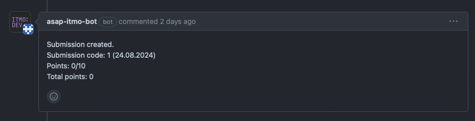

# Отправка лабораторных на проверку

1. Создайте ветку с именем `lab-N` , где N - номер лабораторной.
2. Запуште её на GitHub, откройте `pull request` в ветку `master`
3. Далее создайте pull request
4. После создания pull request, должен прийти комент оповещающий о добавлении в систему вашего сабмишена
   
5. После **очной защиты** лабораторной работы на практическом занятии преподаватель ставит апрув на пр, в очереди ваш
   сабмишен получит статус Reviewed
6. Далее **преподаватель** мержит ваш пр, после чего система автоматически ставит вашему сабмишену оценку согласно даты
   сдачи (с учётом штрафов если был просрочен дедлайн)

Для более подробной информации по работе системы, ознакомьтесь
с [ASAP – инструкция для студентов](asap-student-guide.md)